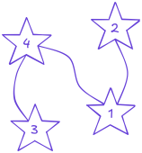
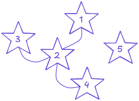

La Organización Federal de Misiones Interplanetarias (OFMI) mantiene un gigantesco archivo con información sobre constelaciones observadas en distintos sistemas estelares. En estos registros, cada estrella está conectada con otras estrellas mediante líneas imaginarias que las astrónomas utilizan para identificar patrones.

Recientemente, un observatorio espacial descubrió un nuevo sistema estelar conformado por $n$ estrellas, las cuales identificó con índices del $1$ al $n$. Durante la transmisión de datos proveniente del observatorio, parte de la información sobre las constelaciones de este sistema se perdió debido a una interferencia cósmica. El mapa exacto de conexiones entre estrellas desapareció, pero afortunadamente algunos datos lograron recuperarse.

Para cada estrella se conoce cuántas conexiones tenía originalmente con otras estrellas dentro del sistema estelar. Cada conexión une exactamente dos estrellas distintas y las conexiones son **bidireccionales**. Es decir, si la estrella $U$ está conectada con la estrella $V$, entonces $V$ también está conectada con $U$.

Además, no puede haber más de una conexión entre el mismo par de estrellas. En otras palabras, cualquier par de estrellas tiene a lo más una conexión entre ellas.

La última tarea que te ha asignado la división de cómputo y análisis de la OFMI es ayudarles a reconstruir el archivo de constelaciones del nuevo sistema estelar utilizando la información que pudo recuperarse.

# Problema

Dado el número de estrellas observadas en el sistema estelar y el número de conexiones que tenía cada estrella, debes reconstruir las constelaciones del sistema, es decir, un posible conjunto de conexiones entre estrellas que sea consistente con la información recuperada.

Las conexiones que reconstruyas son consistentes si cumplen que cada estrella tiene **exactamente el número de conexiones especificado** y no existen conexiones entre una estrella y sí misma.

# Entrada

En la primera línea vendrá un entero $n$, representando el número de estrellas en el sistema estelar.

En la segunda línea vendrán $n$ enteros, donde el $i$-ésimo entero representa el número de conexiones $D_i$ que tenía la estrella con índice $i$.

# Salida

En la primera línea imprime un entero $m$, representando el número de conexiones que hay en el sistema estelar.

En las siguientes $m$ líneas imprime dos enteros $U_j$ y $V_j$, donde la $j$-ésima línea representa que existe una conexión entre las estrellas $U_j$ y $V_j$.

Se garantiza que siempre existe al menos una forma válida de reconstruir las constelaciones y, en caso de que existan varias formas de reconstruirlas, puedes imprimir cualquiera de ellas siempre y cuando sea consistente con la información recuperada.

Recuerda que las conexiones que imprimas no pueden conectar a una estrella consigo misma y no puede haber más de una conexión entre el mismo par de estrellas.

# Ejemplo

||examplefile
sub2.sample
||description
Este ejemplo entra dentro de los límites de la **subtarea $2$**.

Supongamos que existen $4$ estrellas y que cada una tiene el siguiente número de conexiones:

- La estrella con índice $1$ tiene $2$ conexiones.
- La estrella con índice $2$ tiene $1$ conexión.
- La estrella con índice $3$ tiene $1$ conexión.
- La estrella con índice $4$ tiene $2$ conexiones.

Una posible reconstrucción de las constelaciones que respeta el número de conexiones de cada estrella es la siguiente:

||examplefile
sub4.sample
||description
Las constelaciones que vemos en la salida son las siguientes:

Observa que es posible que algunas estrellas no tengan conexiones.
||end

# Límites

- $1 \leq n \leq 10^5$.
- $0 \leq D_i \leq n - 1$.
- $\sum_{i = 1}^{n} D_i \leq 5 \times 10^5$; es decir, la suma del número de conexiones de todas las estrellas será a lo más $5 \times 10^5$.

# Subtareas

- **Subtarea 1 (14 puntos):**
  - $0 \leq D_i \leq 1$, es decir, todas las estrellas tienen una conexión o ninguna.
- **Subtarea 2 (17 puntos):**
  - $0 \leq D_i \leq 2$, es decir, todas las estrellas tienen $0$, $1$ o $2$ conexiones.
- **Subtarea 3 (25 puntos):**
  - $D_i = D_{i + 1}$ para toda $1 \leq i \leq n - 1$, es decir, todas las estrellas tienen el mismo número de conexiones.
- **Subtarea 4 (25 puntos):**
  - $1 \leq n \leq 100$.
- **Subtarea 5 (19 puntos):**
  - Sin restricciones adicionales.

**Nota:** Cada subtarea tiene todos sus casos agrupados.
