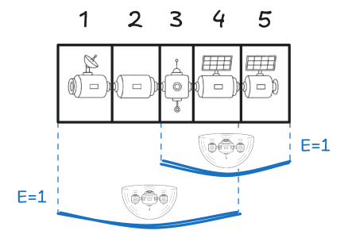

La Organización Federal de Misiones Interplanetarias (OFMI) quiere desarrollar un sistema de defensa contra la inclemente radiación cósmica para su nueva estación espacial.

La estación está dividida en $n$ sectores contiguos, numerados del $1$ al $n$. Para proteger cada sector, la OFMI enviará $k$ drones especializados, también numerados del $1$ al $k$. Cada dron tiene una red de defensa que puede extenderse sobre un rango predeterminado de sectores contiguos. Cuando el $i$-ésimo dron activa su red de defensa, esta se extiende desde el sector $L_i$ hasta el sector $R_i$ y protege cada sector dentro de ese rango con $E_i$ unidades de energía.

A continuación se muestra un ejemplo con una estación espacial de $n = 5$ sectores. Además, se muestran $k = 2$ drones desplegando sus redes de defensa: el primero tiene un rango $L_1 = 3$, $R_1 = 5$ y una protección de $E_1 = 1$ unidad de energía. El segundo dron tiene un rango $L_2 = 1$, $R_2 = 4$ y una protección de $E_2 = 1$ unidad de energía.

Observa que un sector puede ser cubierto por múltiples drones, como es el caso de los sectores $3$ y $4$ en el ejemplo anterior. Cuando esto ocurre, se considera que esos sectores están protegidos con una energía igual a la suma de las unidades de energía de todas las redes de defensa que los cubren. Como ambas redes de defensa en el ejemplo anterior tienen una sola unidad de energía, los sectores $3$ y $4$ tienen una protección total de $1 + 1 = 2$ unidades de energía.

Después de que **todos los drones hayan activado sus redes de defensa**, las ingenieras de la OFMI quieren analizar el estado final de la estación. Para distintos valores $X_i$ de energía, quieren saber cuántos sectores quedaron protegidos con al menos $X_i$ unidades de energía total.

Siguiendo tu trayectoria en la división de cómputo y análisis de la OFMI, te han asignado la tarea de crear un programa que pueda responder estas consultas eficientemente.

# Problema

Dado el número de sectores de la estación espacial, así como el rango de cobertura y las unidades de energía de las redes de defensa desplegadas por todos los drones, deberás determinar, para múltiples valores de $X_i$, cuántos sectores de la estación tienen una protección de al menos $X_i$ unidades de energía.

Te invitamos a leer los límites de las subtareas, ya que **es posible obtener muchos puntos en este problema con soluciones parciales**. Por ejemplo, para todas las subtareas excepto la última, todas las redes de defensa tendrán una sola unidad de energía ($E_i = 1$).

# Entrada

En la primera línea vendrán dos enteros $n$ y $k$, representando el número de sectores de la estación espacial y el número de drones que activarán su red de defensa, respectivamente.

En las siguientes $k$ líneas vendrán tres enteros $L_i$, $R_i$ y $E_i$, representando que el $i$-ésimo dron activará una red de defensa desde el sector $L_i$ hasta el sector $R_i$, protegiendo cada sector en ese rango con $E_i$ unidades de energía.

En la siguiente línea vendrá un entero $q$, representando el número de consultas que debes responder.

En las siguientes $q$ líneas vendrá un entero $X_i$, representando una consulta en la que debes determinar cuántos sectores tienen al menos $X_i$ unidades de energía total de protección.

# Salida

Imprime $q$ líneas. En la $i$-ésima línea imprime un solo entero representando cuántos sectores de la estación espacial tienen al menos $X_i$ unidades de energía total de protección.

# Ejemplo

||examplefile
sub1.sample
||description
Este ejemplo es el mismo que ilustramos en la descripción del problema.

Después de desplegar las redes de defensa de ambos drones, los sectores quedan con la siguiente energía total de protección: $1, 1, 2, 2, 1$.

La primera consulta pregunta cuántos sectores tienen al menos $5$ unidades de energía total de protección. Dado que ningún sector tiene más de $2$ unidades de energía total de protección, la respuesta es $0$.

La segunda consulta pregunta cuántos sectores tienen al menos una unidad de energía total de protección. Como los $5$ sectores están cubiertos por al menos un dron, la respuesta es $5$.

La tercera consulta pregunta cuántos sectores tienen al menos $2$ unidades de energía total de protección. Como se mencionó en la descripción, únicamente los sectores $3$ y $4$ acumularon $2$ unidades de energía, por lo que la respuesta es $2$.
||examplefile
sub3.sample
||description
Este ejemplo entra dentro de los límites de la **subtarea $3$**.

La estación espacial tiene $n = 5$ sectores y desplegará $k = 4$ drones.

Observa que cada red de defensa cubre un solo sector ($L_i = R_i$). El sector $2$ está cubierto por una sola red, el sector $3$ está cubierto por dos redes y el sector $5$ está cubierto por una sola red.

La primera consulta pregunta cuántos sectores tienen al menos una unidad de energía total de protección. La respuesta es $3$.

La segunda consulta pregunta cuántos sectores tienen al menos $2$ unidades de energía total de protección. Solo el sector $3$ está cubierto por dos redes, por lo que la respuesta es $1$.
||examplefile
sub2.sample
||description
Este ejemplo entra dentro de los límites de la **subtarea $2$**.

La estación espacial tiene $n = 1,000,000,000 = 10^9$ sectores y desplegará $k = 2$ drones.

La única consulta pregunta cuántos sectores tienen al menos $2$ unidades de energía total de protección. Observa que los sectores con ese nivel de protección se encuentran entre el sector $7,000,000$, que empieza a ser cubierto por el segundo dron, y el sector $50,000,000$, que termina de ser cubierto por el primer dron. Es decir, hay $50,000,000 - 7,000,000 + 1 = 43,000,001$ sectores protegidos por exactamente dos redes de defensa.
||end

# Límites

- $1 \leq n \leq 10^9$.
- $1 \leq k \leq 10^5$.
- $1 \leq L_i \leq R_i \leq n$.
- $1 \leq E_i \leq 10^9$.
- $\sum_{i = 1}^{k} E_i \leq 10^9$; es decir, la suma de las unidades de energía de todas las redes de defensa será a lo más $10^9$.
- $1 \leq q \leq 10^5$.
- $1 \leq X_i \leq 10^9$.

# Subtareas

- **Subtarea 1 (12 puntos):**
  - $1 \leq n \leq 100$.
  - $E_i = 1$, es decir, todas las redes de defensa tienen una sola unidad de energía.
- **Subtarea 2 (8 puntos):**
  - $1 \leq k \leq 2$, es decir, la estación desplegará un máximo de dos drones.
  - $E_i = 1$, es decir, todas las redes de defensa tienen una sola unidad de energía.
- **Subtarea 3 (19 puntos):**
  - $1 \leq n \leq 10^6$.
  - $L_i = R_i$, es decir, todas las redes de defensa protegerán un solo sector de la estación.
  - $E_i = 1$, es decir, todas las redes de defensa tienen una sola unidad de energía.
- **Subtarea 4 (26 puntos):**
  - $1 \leq n \leq 10^6$.
  - $E_i = 1$, es decir, todas las redes de defensa tienen una sola unidad de energía.
  - $q = 1$, es decir, las ingenieras solo quieren responder una consulta.
- **Subtarea 5 (8 puntos):**
  - $1 \leq n \leq 10^6$.
  - $E_i = 1$, es decir, todas las redes de defensa tienen una sola unidad de energía.
- **Subtarea 6 (16 puntos):**
  - $E_i = 1$, es decir, todas las redes de defensa tienen una sola unidad de energía.
- **Subtarea 7 (11 puntos):**
  - Sin restricciones adicionales.

**Nota:** Cada subtarea tiene todos sus casos agrupados.
